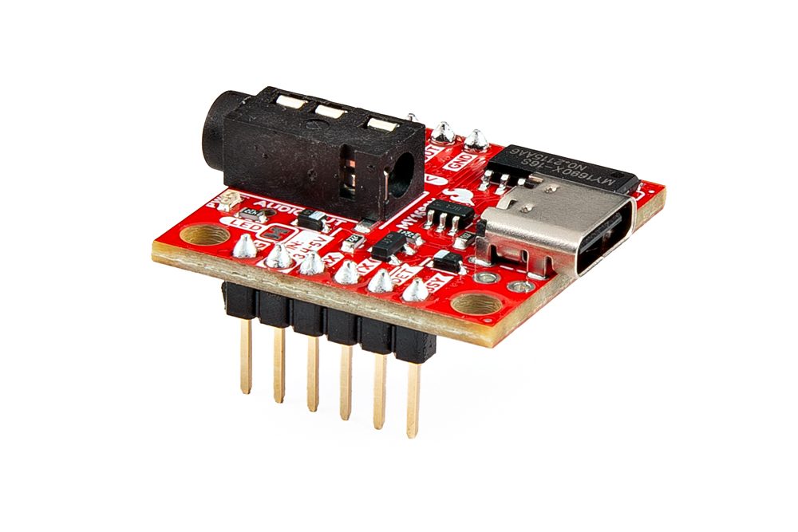
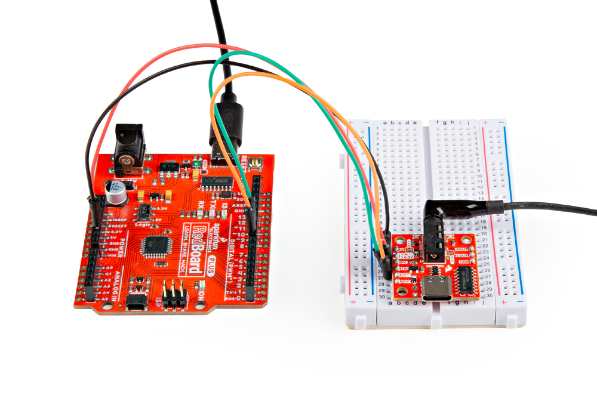

Start by soldering your preferred connector or wire to the to the power and serial pins (GND, VIN, RX and TX) on the Audio Player Breakout. We opted to just solder male headers to all the pins to plug it into a breadboard for easy prototyping like the photo below:

[{ width="600"}](./assets/img/Audio_Player_Breakout-Headers.jpg)

Next, make the following connections to your Arduino development board:

| Audio Player | Arduino |
| ------------ | ------- |
| Ground       | Ground  |
| VIN          | 5V      |
| RX           | D9      |
| TX           | D8      |

[{ width="600"}](./assets/img/Audio_Player_Breakout-Arduino.jpg "Click to enlarge")

Now that your Audio Player Breakout is wired up to your Arduino, let's move on to formatting and adding the audio tracks we'll be playing using the Arduino library.