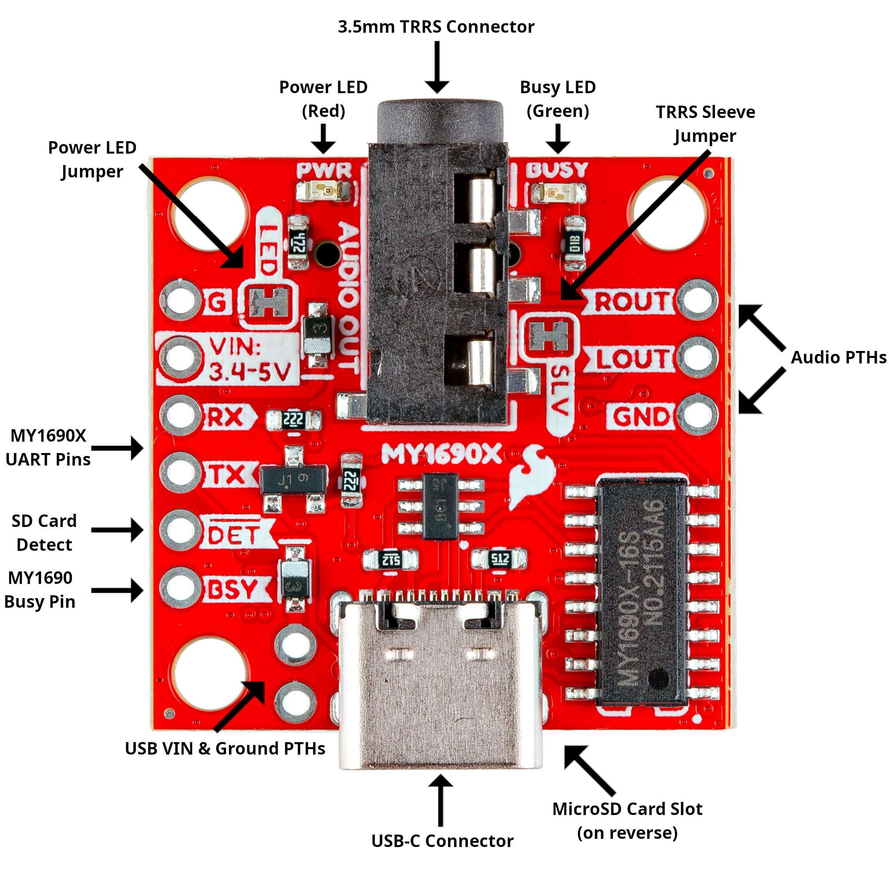
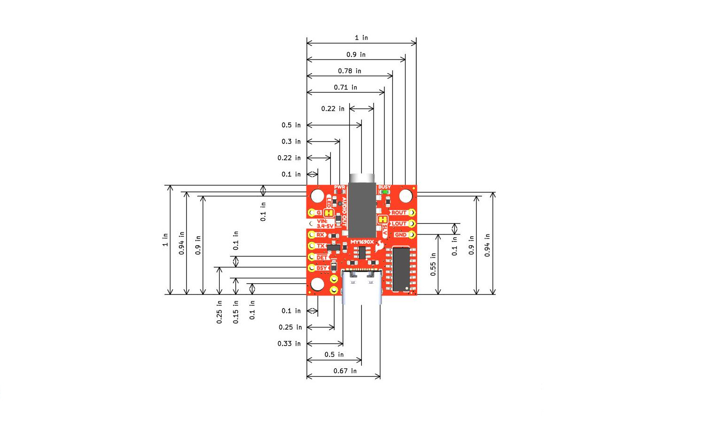

Let's take a closer look at the SparkFun Audio Player Breakout - MY1690X and the hardware present on the board. The photo below highlights the major components on this shield that we'll cover in more detail in this section:

[{ width="600"}](./assets/img/Audio_Player_Breakout-Annotated.jpg "Click to enlarge")

## MY1690X MP3 Decoder IC

The MY1690X is an MP3 decoder IC that works with both MP3 and WAV audio files stored on a connected &micro;SD card. The MY1690X can function both as a removable USB drive when connected over USB to load, view or edit files on the SD card. The IC operates over a serial-UART interface at 3.3V TTL using a command set to control audio playback (Play, Pause, Next, etc.), volume and equalizer settings and query statuses (SD card contents, track name/length, etc.). It supports audio files with sampling rates between 8 and 48k with bit rates between 8 and 320Kbps.

## Connectors

The Audio Player Breakout - MY1690X has a pair of connectors on the board. A USB-C connector and 3.5mm TRRS connector.

### USB-C

The USB-C connector on the board connects directly to the MY1690X to mount it as a removable USB drive when a microSD card is inserted and the board is plugged into a computer. This allows you to directly add and remove audio files to a connected microSD card. This works great for small audio files but in our testing we found the transfer speed is quite slow and can take several minutes to upload larger audio files. We recommend uploading large files using a USB SD card reader or directly connecting your SD card to your computer.

When connected over USB-C (and with a microSD card plugged in) the MY1690X will stay in USB drive "mode" until a power cycle. The MY1690X does not have a Reset line so either unplug the board or press the RESET button on the shield to cycle power.

## Audio Output

The shield routes the audio output from the MY1690X to a 3.5MM TRRS audio connector as well as three 0.1"-spaced through hole pins. This allows you to easily plug in a pair of headphones directly to the shield or solder an alternate audio output. Note, the MY1690X can easily output audio for small headphones but you'll need an external amplifier on the audio output to drive larger speakers.

## MicroSD Card Slot

The audio player breakout's microSD card slot works with most standard SD cards that have up to 32GB storage space and formatted to FAT16 or FAT32. The MY1690X requires specific naming of files and folders stored on the card. Read on to the MicroSD Card Setup section of this guide for detailed information on naming conventions.

## Power

The Audio Player Breakout has two primary ways for powering during normal (not USB drive) operation through the **VIN** and **VUSB** PTHs. Both of these pins are netted with VCC for the MY1690X and **3.4 and 5V**. The **VUSB** pin is also tied to the USB-C connector so it can be used either as a 5V power output with USB-C connector or as a power input while USB-C is **not** connected.

The USB-C connector can provide power to the board but the MY1690X defaults to operate as a removable drive when it detects a connection to the D+/- pins USB signals. 

## Pinout

The board breaks out the MY1690X's serial-UART pins (TX and RX), SD card detect, busy signal and power pins (VIN and GND) on one side and the audio output (Left, Right and Ground) on the opposite side. It also includes pins for VUSB and Ground next to the USB-C connector. The MY1690X communicates at 3.3V but the board has built-in level shifting to work with 5V logic boards.  

## LEDs

The board has a pair of LEDs labeled **PWR** and **BUSY**. The red Power LED indicates when the board has power. The green Busy LED indicates when the MY1690X is busy playing audio.

## Solder Jumpers

The Audio Player Breakout has three solder jumpers labeled **BUSY**, **PWR** and **SLV**. The **BUSY** and **PWR** solder jumpers complete the circuit for their respective LEDs and are CLOSED by default. Open them to disable these LEDs. The **SLV** jumper connects the sleeve pin of the TRRS connector to ground and is CLOSED by default. Open this jumper to free up the sleeve of the TRRS connector/cable. Most headphones with built-in mics send the MIC signal on the sleeve of their TRRS connector.

## Board Dimensions

The Audio Player Breakout measures 1" x 1" (25.4mm x 25.4mm) with three mounting holes that fit a [4-40 screw](https://www.sparkfun.com/screw-phillips-head-1-4-4-40-10-pack.html).

[{ width="600"}](./assets/board_files/SparkFun_Audio_Player_Breakout_MY1690X-16S.jpg "Click to enlarge)

