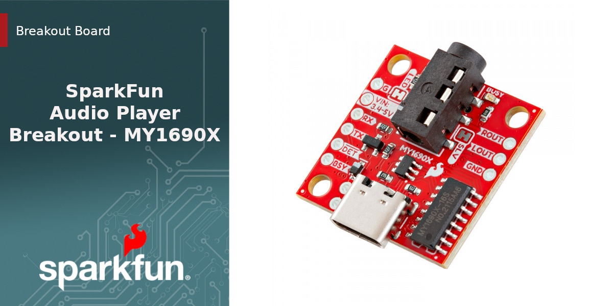

[{ width="600"}](./assets/img/SparkFun_Audio_Player_Breakout_MY1690X-Banner.jpg "Click to enlarge")

The SparkFun Audio Player Breakout - MY1690X is a compact audio player built around the MY1690X audio decoder IC. The MY1691X supports both .WAV and .MP3 audio files stored on a connected microSD card with up to 32GB capacity and formatted to FAT16 or FAT32. The MY1690X communicates over serial UART with a simple command set 

You'll need the following items to follow along with this tutorial:

* [SparkFun Audio Player Breakout - MY1690X](https://www.sparkfun.com/sparkfun-audio-player-breakout-my1690x.html)
* [SparkFun RedBoard Plus](https://www.sparkfun.com/sparkfun-redboard-plus.html) or other development board
* [Male Breakaway Headers](https://www.sparkfun.com/male-breakaway-headers.html) or other header type
* [USB-C Cable](https://www.sparkfun.com/reversible-usb-a-to-c-cable-0-8m.html)

This breakout does require soldering to work properly so you'll need a soldering iron and soldering accessories to assemble it into an Arduino circuit.

## Topics Covered

This document contains three main sections: **Quickstart Guide**, **Hardware** and **Software**. 

The Quickstart Guide assumes a working knowledge of how to assemble and use breakout boards with an Arduino development board along with the required software to program them for your project's needs. It covers a quick assembly and then jumps right into getting the necessary software packages installed to start uploading code in just a few short minutes.

The Hardware pages cover a hardware overview that provides a detailed overview of the Audio Player Breakout - MY1690X covering all the major components on the board in detail as well as a hardware assembly page which goes over the steps required to assemble and use the Audio Player Breakout with an Arudino board.

The Software pages give instructions on installing the SparkFun MY1690 MP3 Decoder Arduino and using the examples included in it.

## Resources and Documentation

You'll find the board design files (KiCad files & schematic), relevant documentation (datasheets, white papers, etc.) and other helpful links in the **Resources**. Lastly, the **Support** section includes a Troubleshooting page that includes any helpful tips specific to this board as well as information on how to receive technical support from SparkFun.